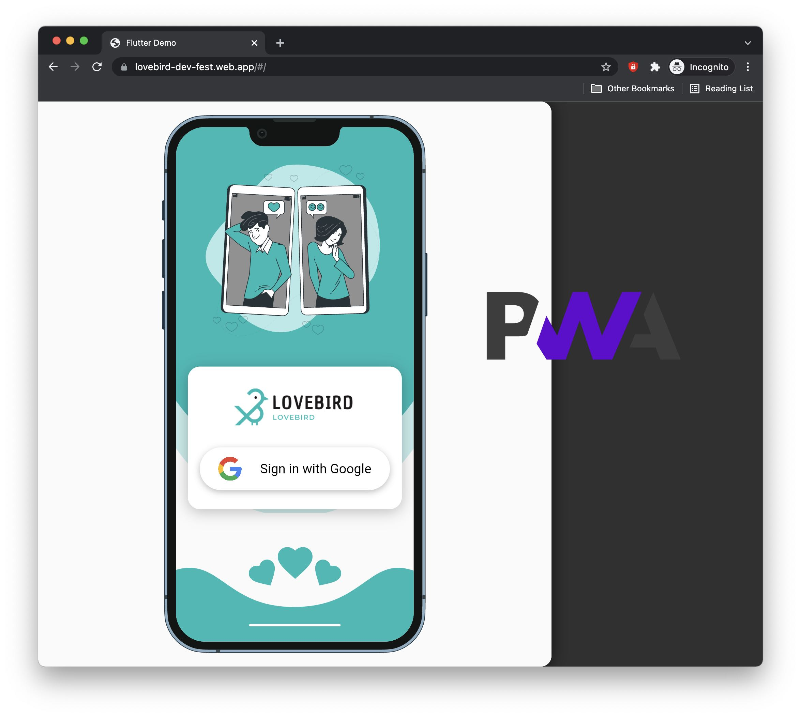

# lovebird

A new Flutter project.

##### ``` Installation ```
1. the application only run on ```real device``` due to GPS functionality.
2. build release on Android/IOS/ Web


```python
    if lazy is None:
        add_picture()
        add_more_readme()
```


##### ``` Tech Feature ```
1. Sign in with google account.
2. Realtime data.
3. Web/ Android/ IOS work greaten together.
4. Flutter Bloc + Cross platform lib.
4. ``` Lovebird powered by Firebase sama :>```
5. Dynamic view for Flutter Web (PWA stuff) https://lovebird-dev-fest.web.app (lite test)
5. 90% coding at 3am (a bit madness).

[PWA - Flutter :> ](https://lovebird-dev-fest.web.app)
#### [Figma](https://www.figma.com/file/HCAaJg9ldN4Vc2JGBSalHo/LoveBird?node-id=0%3A1)

-------
##### ```Vietnamese, en-sub will coming soon```
***Phản biện :*** Các ứng dụng như [0] dating nó liệt kê vị trí qua GPS đôi khi cũng hơi khó chịu ghi mình phải cập nhật địa chỉ vật lý để giúp cho các ứng dụng có thể tìm kiếm và ghép mảnh. Không biết sao nhưng mình thấy vậy dễ bị scam lắm mình thích một chút thực tế và tinh tế hơn 👷🏻‍♂️

***Ý tưởng ứng dụng*** : sẽ không sử dụng địa chỉ vật lý (tên đường,...) nữa mà chỉ cần họ ngồi gần nhau như quán cafe lầu 1, lầu 2, phòng học,...

***Case study*** : Bạn vào một quán cafe, ***hay hội nghị / workshop*** hay địa điểm nào bạn thường hay tới bạn sẽ có thể tìm kiếm được nữa kia của mình trong cùng không gian đó. Chỉ khi đó bạn và đối phương cũng đều mở cơ hội để tìm kiếm nữa kia của mình với các sở thích, địa điểm hay không gian. :heart_decoration:

***Tech*** : Sử dụng sóng BLE để phát tính hiệu, tính hiệu này có thể xa tới 10-100m (tuỳ vào thiết bị) các thiết bị điện tử có thể scan địa chỉ này với CSDL được xây dựng của nữa kia để tìm các thông tin liên lạc như đường dẫn mạng xã hội,...

***Lưu ý*** Đừng tham khảo các ứng dụng ngoài thì trường quá có thể là họ đã sử dụng những ý tưởng này để xây dựng sản phẩm, chúng ta khác họ hãy giữ vững nhé ✊

*** Cách tìm kiếm lợi nhuận***
1. Xem quảng cáo để lưu hoặc setup thông tin.
2. Xem quảng cáo để hiển thị thông báo gần.
3. Xem quảng cáo để kích hoạt mở cơ hội tìm kiếm.


Từ ghi tắt
**[0]** : Facebook, Tinder,...

*Đối tượng người hoặc chó mèo :v: 


***NGUỒN CẢM HỨNG CỦA DỰ ÁN*** VIDEO CỦA THÁI CÔNG YOUTUBE 💁🏻‍♂️

*Author: Duy Béo 🖤 cô đơn quá >..<
